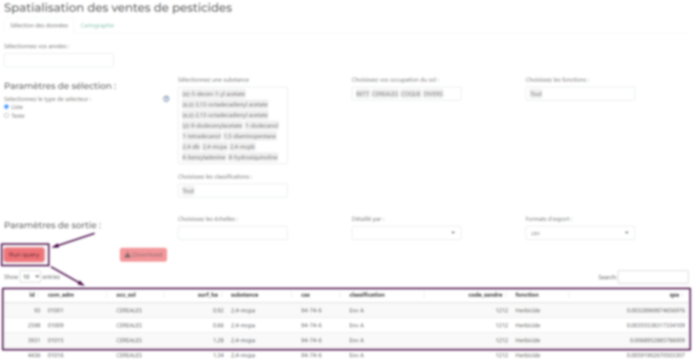
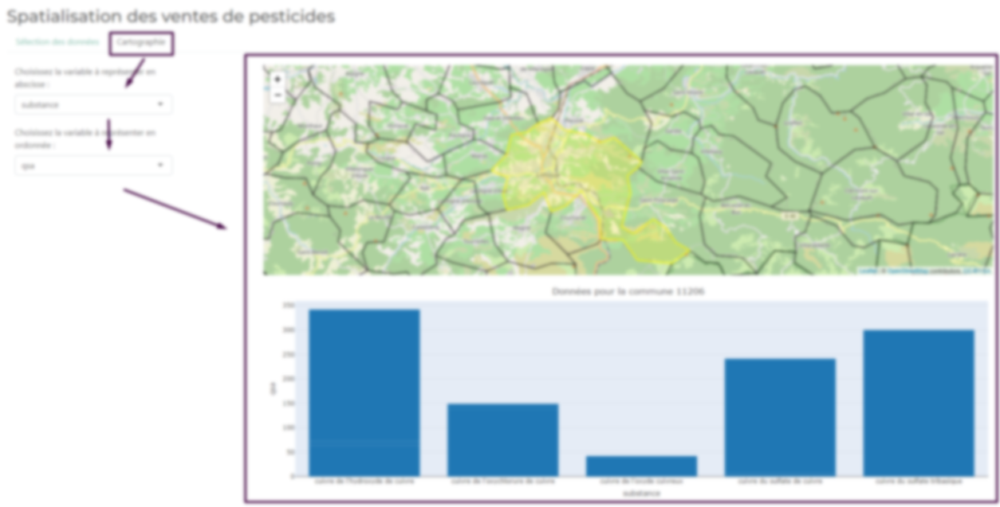

# BNVD-s-app
A R Shiny app to extract data stored in a postgres server and use it in a data-visualisation based on leaflet and plotly
# How?
### The interfaces were voluntarily blurred because the data is not in opendata
Once the app is launched there's two pages, one for creating the selection :
||
|:--:| 
|*Selection interface*|

||
|:--:| 
|*Datavizualisation interface*|
